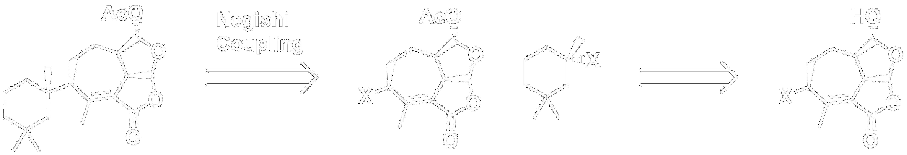
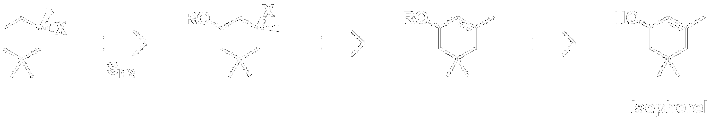
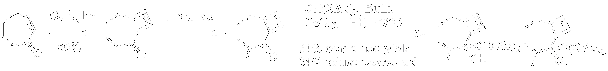
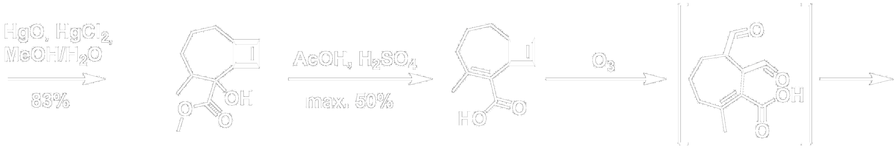
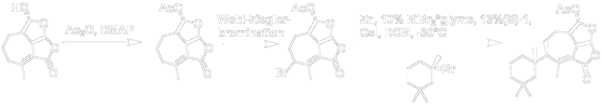
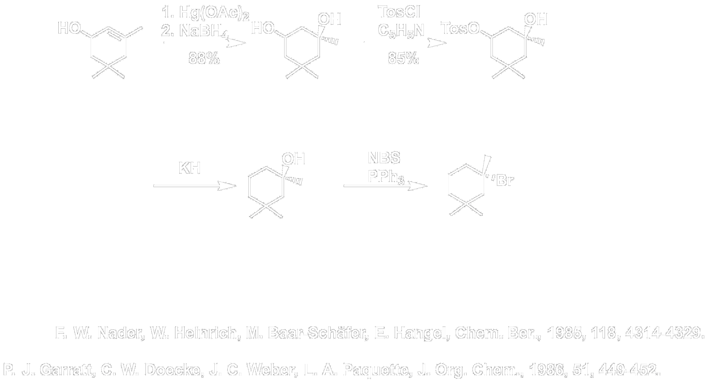
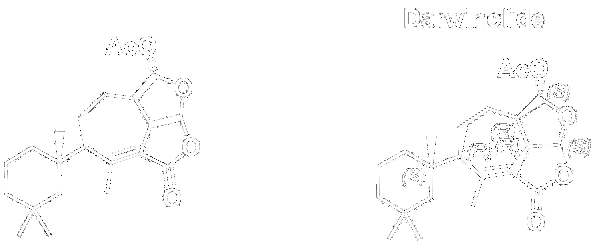

---?image=presentations/background.png
# Molecule 
# of the 
# Month

+++

### Team 
## Darth Sidious
* Christopher Grimm
* Tim Harig
* Vincent Perl
* Nargis Khakin Taniwal
* Jana Caspers

---?image=presentations/background.png
### Retrosynthesis
+++

+++

---?image=presentations/background.png
### Synthesis
+++

Abad A., Arno M., Marin M.L., Zaragoza R.J., *Synlett*, 11, 789-791.

+++

+++

J.T. Bindert, C.J. Cordier, G.C. Fu, *J. Am. Chem. Soc.*, 2012, 134 (41), 17003–17006.

+++

F. W. Nader, W. Heinrich, M. Baar-Schäfer, E. Hangel, *Chem. Ber.*, 1985, 118, 4314-4329.

P. J. Garratt, C. W. Doecke, J. C. Weber, L. A. Paquette, *J. Org. Chem.*, 1986, 51, 449-452.

---?image=presentations/background.png
## Summary
- longest linear sequence: 9
- probably only two stereoisomers

+++

#Join the dark side!

